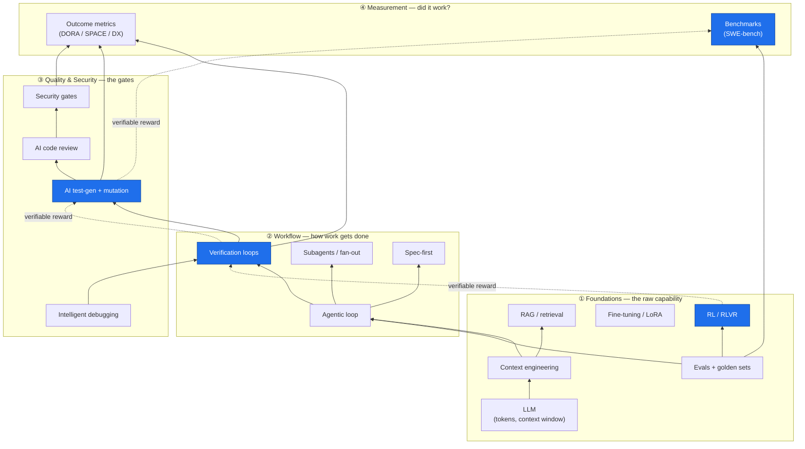

*Every term defined once, plus how the pieces wire together. Use this as the shared vocabulary for the rest of the set.*

> **BLUF:** The field looks like a pile of buzzwords until you see the spine running through it: **a verifiable reward** — an outcome a machine can grade automatically. Foundations, workflow, quality, security, and measurement are five views of that same idea applied at different layers. If you learn one thing here, learn where the automatic grader lives at each layer.

---

## 1. The layered model

Read bottom-up: each layer depends on the ones below it.

The blue nodes and dotted edges are **the verifiable-reward spine** (Section 3). Everything else is scaffolding around it.

---

## 2. Glossary

Definitions are one line each. The last column points to where the concept is expanded.

### Foundations

| Term | Definition | Expanded in |
|---|---|---|
| **LLM** | A model that predicts the next token; everything it "knows" is compressed into weights, everything it *sees now* is in the context window. | [Foundations](/writing/ai-software-engineering/pillars/01-foundations/) |
| **Token** | The unit an LLM reads/writes (~¾ of a word). Cost and context limits are counted in tokens. | [Foundations](/writing/ai-software-engineering/pillars/01-foundations/) |
| **Context window** | The working memory holding the whole conversation, files read, and tool output. Finite; performance degrades as it fills. | [Foundations](/writing/ai-software-engineering/pillars/01-foundations/) |
| **Context engineering** | Deliberately choosing what goes into the window and when. The highest-leverage skill in the stack. | [Foundations](/writing/ai-software-engineering/pillars/01-foundations/) · [Workflow](/writing/ai-software-engineering/pillars/02-agentic-workflow/) |
| **Prompt engineering** | Wording instructions to steer behavior. A subset of context engineering; necessary, not sufficient. | [Foundations](/writing/ai-software-engineering/pillars/01-foundations/) |
| **Temperature** | Randomness knob for sampling. Low = deterministic/repeatable; high = diverse/creative. | [Foundations](/writing/ai-software-engineering/pillars/01-foundations/) |
| **RAG** (retrieval-augmented generation) | Fetch relevant facts/code at query time and put them in the window. The default way to give a model *knowledge*. | [Foundations](/writing/ai-software-engineering/pillars/01-foundations/) |
| **Embedding** | A vector encoding of text so similar meanings sit close together; powers semantic retrieval. | [Foundations](/writing/ai-software-engineering/pillars/01-foundations/) |
| **Vector store** | A database of embeddings supporting nearest-neighbor search for RAG. | [Foundations](/writing/ai-software-engineering/pillars/01-foundations/) |
| **Reranking** | A second, precise pass that reorders retrieved candidates before they hit the window. | [Foundations](/writing/ai-software-engineering/pillars/01-foundations/) |
| **Agentic retrieval** | Letting the model *decide* what to fetch via tools, instead of pre-stuffing context. | [Foundations](/writing/ai-software-engineering/pillars/01-foundations/) |
| **Fine-tuning** | Updating weights on task data to change *behavior/format/style* — not to add knowledge. | [Foundations](/writing/ai-software-engineering/pillars/01-foundations/) |
| **LoRA / QLoRA** | Cheap fine-tuning that trains small adapter layers instead of the whole model. | [Foundations](/writing/ai-software-engineering/pillars/01-foundations/) |
| **RLHF** | Reinforcement learning from *human* preference labels; aligns tone/helpfulness. | [Foundations](/writing/ai-software-engineering/pillars/01-foundations/) |
| **RLVR** | RL from *verifiable* rewards — code that compiles and passes tests is its own reward signal, no humans needed. Why coding models leapt. | [Foundations](/writing/ai-software-engineering/pillars/01-foundations/) |
| **Reward model** | A learned scorer that approximates human judgment when no automatic check exists. | [Foundations](/writing/ai-software-engineering/pillars/01-foundations/) |
| **Eval** | An automated test of model/agent behavior against a known-good set. The flywheel — run before shipping any change. | [Foundations](/writing/ai-software-engineering/pillars/01-foundations/) · [Prototype A](/writing/ai-software-engineering/prototypes/a-eval-harness/) |
| **Golden set** | The curated inputs+expected-outputs an eval scores against. | [Foundations](/writing/ai-software-engineering/pillars/01-foundations/) |
| **LLM-as-judge** | Using an LLM to grade free-text output when there's no exact oracle. Powerful but needs its own validation. | [Foundations](/writing/ai-software-engineering/pillars/01-foundations/) · [Measurement](/writing/ai-software-engineering/pillars/05-measurement/) |

### Workflow

| Term | Definition | Expanded in |
|---|---|---|
| **Agent** | An LLM in a loop with tools: it reads, runs commands, observes results, and iterates toward a goal — vs a chatbot that answers and waits. | [Workflow](/writing/ai-software-engineering/pillars/02-agentic-workflow/) |
| **Agentic loop** | perceive → plan → act (tool) → observe → repeat, until a stop condition. | [Workflow](/writing/ai-software-engineering/pillars/02-agentic-workflow/) |
| **Tool use** | The model calling functions (run tests, read files, query a DB) and getting structured results back. | [Workflow](/writing/ai-software-engineering/pillars/02-agentic-workflow/) |
| **ReAct** | A loop pattern interleaving reasoning and tool actions; the common shape of tool-using agents. | [Workflow](/writing/ai-software-engineering/pillars/02-agentic-workflow/) · [Prototype C](/writing/ai-software-engineering/prototypes/c-incident-triage-agent/) |
| **Verification loop** | Giving the agent a machine-checkable signal (test/build/lint/diff/screenshot) so it grades and corrects its own work. | [Workflow](/writing/ai-software-engineering/pillars/02-agentic-workflow/) |
| **Subagent** | A child agent in its own fresh context that does focused work and reports a summary — keeps the main context clean. | [Workflow](/writing/ai-software-engineering/pillars/02-agentic-workflow/) |
| **Fan-out** | Running many agents in parallel, one per file/hypothesis/task. | [Workflow](/writing/ai-software-engineering/pillars/02-agentic-workflow/) |
| **Spec-first** | Interview → write a self-contained spec → implement in a fresh session. Stops the model solving the wrong problem. | [Workflow](/writing/ai-software-engineering/pillars/02-agentic-workflow/) |
| **Adversarial review** | A fresh-context agent that only sees the diff and tries to find gaps — the writer shouldn't grade itself. | [Workflow](/writing/ai-software-engineering/pillars/02-agentic-workflow/) · [Quality](/writing/ai-software-engineering/pillars/03-quality-and-testing/) |
| **MCP** (Model Context Protocol) | A standard for connecting agents to external tools/data sources. | [Workflow](/writing/ai-software-engineering/pillars/02-agentic-workflow/) |

### Quality & security

| Term | Definition | Expanded in |
|---|---|---|
| **Mutation testing** | Deliberately break the code and check whether the tests catch it; the *kill rate* is the real measure of test quality. | [Quality](/writing/ai-software-engineering/pillars/03-quality-and-testing/) · [Prototype B](/writing/ai-software-engineering/prototypes/b-test-generation/) |
| **Coverage** | Which lines/branches ran under test. Necessary, not sufficient — high coverage with weak asserts still misses bugs. | [Quality](/writing/ai-software-engineering/pillars/03-quality-and-testing/) |
| **Property-based testing** | Assert invariants ("output is always sorted") and let a fuzzer search for counterexamples. | [Quality](/writing/ai-software-engineering/pillars/03-quality-and-testing/) |
| **Differential / metamorphic testing** | Compare two implementations, or assert how output *should change* when input changes — for cases with no oracle. | [Quality](/writing/ai-software-engineering/pillars/03-quality-and-testing/) |
| **Prompt injection** | Adversarial text that hijacks the model's instructions. **Indirect** injection arrives via content the agent *reads* (a web page, a log). | [Security](/writing/ai-software-engineering/pillars/04-security/) |
| **Slopsquatting** | Attackers pre-register package names LLMs hallucinate, so an AI-suggested `import` installs malware. | [Security](/writing/ai-software-engineering/pillars/04-security/) |
| **Least-privilege tools** | Give an agent only the permissions its task needs; read-only by default; human gate for irreversible actions. | [Security](/writing/ai-software-engineering/pillars/04-security/) |
| **AIOps** | AI applied to operations — log/anomaly analysis, incident triage, automated diagnosis. | [Security](/writing/ai-software-engineering/pillars/04-security/) · [Prototype C](/writing/ai-software-engineering/prototypes/c-incident-triage-agent/) |

### Measurement

| Term | Definition | Expanded in |
|---|---|---|
| **DORA** | Four delivery metrics: deploy frequency, lead time, change-fail rate, MTTR. The system-level ground truth. | [Measurement](/writing/ai-software-engineering/pillars/05-measurement/) |
| **SPACE** | Multi-dimensional productivity framework (satisfaction, performance, activity, communication, efficiency) — resists single-metric gaming. | [Measurement](/writing/ai-software-engineering/pillars/05-measurement/) |
| **DX Core 4** | A practical developer-experience metric set for instrumenting rollouts. | [Measurement](/writing/ai-software-engineering/pillars/05-measurement/) |
| **SWE-bench (Verified)** | The standard benchmark of agents fixing real GitHub issues; the agentic-coding yardstick. | [Measurement](/writing/ai-software-engineering/pillars/05-measurement/) · [Prototype A](/writing/ai-software-engineering/prototypes/a-eval-harness/) |
| **pass@k** | Probability at least one of *k* attempts passes the tests; the core eval metric for code generation. | [Prototype A](/writing/ai-software-engineering/prototypes/a-eval-harness/) |
| **Escaped defect rate** | Bugs that reach production — the outcome AI adoption must not worsen. | [Measurement](/writing/ai-software-engineering/pillars/05-measurement/) |
| **Code churn / rework** | Code rewritten shortly after being written; AI's failure mode is inflating this. | [Measurement](/writing/ai-software-engineering/pillars/05-measurement/) |
| **Perception paradox** | Developers *feel* faster with AI while measurement shows the opposite ([METR](https://metr.org/blog/2025-07-10-early-2025-ai-experienced-os-dev-study/)). | [Measurement](/writing/ai-software-engineering/pillars/05-measurement/) |

---

## 3. The spine: one idea at four layers

A **verifiable reward** is the load-bearing concept. It shows up — under different names — at every layer, and the whole knowledge base coheres once you see it.

| Layer | Where the automatic grader lives | Name it goes by | Doc |
|---|---|---|---|
| **Model training** | Reward = "compiles + passes tests" during RL | RLVR | [Foundations](/writing/ai-software-engineering/pillars/01-foundations/) |
| **Task execution** | Agent reruns tests/build and iterates until green | Verification loop | [Workflow](/writing/ai-software-engineering/pillars/02-agentic-workflow/) |
| **Test quality** | Inject bugs; did the tests catch them? | Mutation kill rate | [Quality](/writing/ai-software-engineering/pillars/03-quality-and-testing/) |
| **Evaluation** | Score a model/agent by running task tests / matching known root causes | pass@k · eval harness | [Prototype A](/writing/ai-software-engineering/prototypes/a-eval-harness/), [C](/writing/ai-software-engineering/prototypes/c-incident-triage-agent/) |

> **The practical rule this gives you:** before adopting AI for any task, find (or build) the automatic grader. If a task has no ground-truth oracle, that's the *first* thing to construct — it's what turns "the output looks plausible" into "the output is correct." No grader → no flywheel → the effort quietly stalls.

---

## 4. How the pillars depend on each other

| If you skip… | …this breaks |
|---|---|
| **Evals** ([P1](/writing/ai-software-engineering/pillars/01-foundations/)) | Every other layer flies blind — you can't tell if a model, prompt, or agent change helped or hurt. |
| **Verification loops** ([P2](/writing/ai-software-engineering/pillars/02-agentic-workflow/)) | The agent stops at "looks done" and *you* become the bottleneck; quality gates have nothing to run. |
| **Testing** ([P3](/writing/ai-software-engineering/pillars/03-quality-and-testing/)) | There's no verifiable reward for the workflow layer to use; agents can't self-correct. |
| **Security** ([P4](/writing/ai-software-engineering/pillars/04-security/)) | Autonomy + tools turns a prompt injection into code execution or data loss. |
| **Measurement** ([P5](/writing/ai-software-engineering/pillars/05-measurement/)) | You optimize for the *feeling* of speed (the perception paradox) instead of real outcomes. |

---

## Related

- [Overview / index](/writing/ai-software-engineering/README/)
- Pillars: [Foundations](/writing/ai-software-engineering/pillars/01-foundations/) · [Agentic workflow](/writing/ai-software-engineering/pillars/02-agentic-workflow/) · [Quality & testing](/writing/ai-software-engineering/pillars/03-quality-and-testing/) · [Security](/writing/ai-software-engineering/pillars/04-security/) · [Measurement](/writing/ai-software-engineering/pillars/05-measurement/)
- Prototypes: [A — Eval harness](/writing/ai-software-engineering/prototypes/a-eval-harness/) · [B — Test generation](/writing/ai-software-engineering/prototypes/b-test-generation/) · [C — Incident-triage agent](/writing/ai-software-engineering/prototypes/c-incident-triage-agent/)

## Sources

- METR RCT on AI & developer productivity — https://metr.org/blog/2025-07-10-early-2025-ai-experienced-os-dev-study/
- Anthropic — Best practices for agentic coding — https://code.claude.com/docs/en/best-practices
- SWE-bench — https://www.swebench.com/
