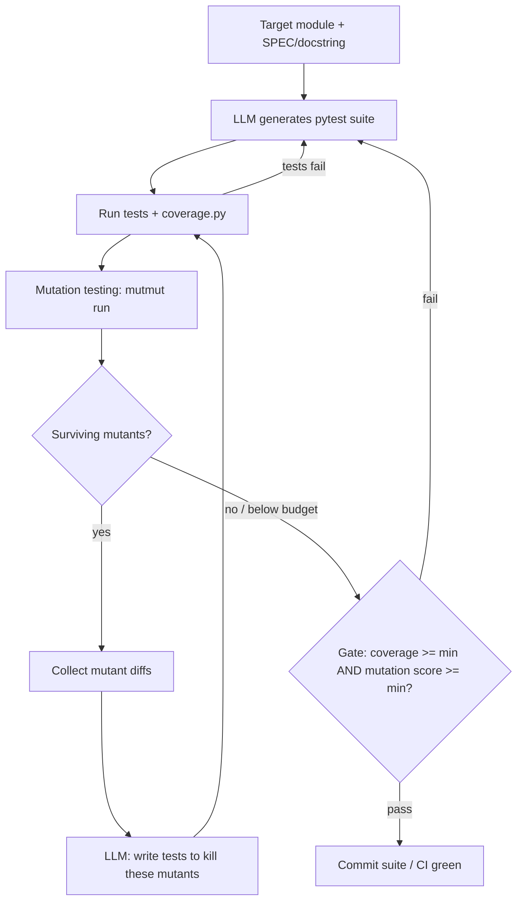

*Generate tests with an LLM, then prove they are worth keeping by measuring how many injected bugs they catch.*

> **BLUF:** Test *count* and line *coverage* are vanity metrics. A suite can hit 100% coverage and catch zero real bugs. The only honest quality gate for generated tests is the **mutation kill rate** — the fraction of injected code mutations the suite detects. This guide builds a loop that anchors generation to a module's SPEC (not its current behavior), measures coverage, runs mutation testing, feeds *surviving mutants* back to the LLM to strengthen the suite, and gates CI on coverage **AND** mutation score.

---

## 1. What you'll build

A closed-loop test generator:

1. Point it at a target module that carries a clear docstring/spec.
2. The LLM drafts a pytest suite anchored to that spec and to edge-case reasoning.
3. You run the suite, measure coverage, then run a mutation tester.
4. Surviving mutants (bugs the suite failed to catch) are fed back to the LLM.
5. The LLM writes new tests to kill them; repeat until the gate passes.

The concept being taught: **mutation score is the real quality signal**, and **spec-anchored generation** prevents the classic failure where the LLM writes tests that simply pin whatever the code does today.

> **KEY INSIGHT:** A test that asserts "what the code does today" cements bugs. If `discount()` has an off-by-one and your generated test encodes that output, the test *protects the bug forever*. Anchor generation to the module's SPEC/docstring and to edge-case reasoning, then let **mutation testing** prove the tests actually catch regressions. Coverage tells you a line *ran*; mutation testing tells you an assertion *mattered*.

| Metric | What it measures | What it misses |
|---|---|---|
| Test count | Nothing about quality | Everything |
| Line coverage | Which lines executed | Whether any assertion checks them |
| Branch coverage | Which branches executed | Whether outcomes are asserted |
| **Mutation score** | Whether tests *fail* when code is broken | Only equivalent-mutant noise |

---

## 2. Architecture



The loop has two exits: tests must first *pass and cover*, then must *kill mutants*. Only when both thresholds clear does the gate go green.

---

## 3. Prerequisites + project layout

- Python 3.11+
- An LLM API key (examples use Anthropic; the wrapper is provider-agnostic)
- `pytest`, `coverage`, `mutmut`

```
test-gen/
├── src/
│   └── pricing.py          # target module (Step 1)
├── tests/
│   └── test_pricing.py     # LLM writes here
├── llm.py                  # provider-agnostic wrapper (Step 2)
├── generate.py             # prompt + generation (Step 2)
├── loop.py                 # feedback orchestration (Step 5)
├── gate.py                 # coverage + mutation gate (Step 6)
├── setup.cfg               # mutmut config
└── requirements.txt
```

Install:

```bash
python -m venv .venv && source .venv/bin/activate
pip install pytest coverage "mutmut<3" anthropic
```

> `mutmut` is preferred here for its simple CLI and result cache. Alternatives: **cosmic-ray** (distributed, config-heavy, good for large suites) and **mutpy** (older, AST-based, less maintained). The loop logic is identical — only the "list surviving mutants" command changes.
>
> **Version caveat:** the `mutmut results` / `mutmut show <id>` output format and mutant identifiers changed between mutmut 2.x and 3.x. The parsing regexes in Steps 4, 8, and 9 target **2.x**, so this guide pins `mutmut<3`. On 3.x, adjust the `results` parsing to the new format (training cutoff Jan 2026 — verify the installed version's CLI).

---

## 4. Step 1 — The target module (spec-anchored)

The docstring **is the contract**. Tests must assert against *this*, not against whatever the function happens to return. Write the spec first, deliberately.

```python
# src/pricing.py
from dataclasses import dataclass


@dataclass(frozen=True)
class LineItem:
    unit_price_cents: int
    quantity: int


def order_total_cents(items: list[LineItem], discount_pct: float) -> int:
    """Compute an order total in integer cents.

    Spec:
      - Subtotal is the sum of unit_price_cents * quantity over all items.
      - discount_pct is a percentage in the closed interval [0, 100].
        The discount reduces the subtotal by that percentage.
      - The result is rounded to the nearest cent using round-half-up
        and returned as a non-negative int.
      - An empty item list yields a total of 0.

    Raises:
      - ValueError if discount_pct is outside [0, 100].
      - ValueError if any quantity is negative.
      - ValueError if any unit_price_cents is negative.

    Examples:
      >>> order_total_cents([LineItem(1000, 2)], 0)
      2000
      >>> order_total_cents([LineItem(1000, 2)], 10)
      1800
      >>> order_total_cents([], 50)
      0
    """
    if not 0 <= discount_pct <= 100:
        raise ValueError("discount_pct must be in [0, 100]")

    subtotal = 0
    for item in items:
        if item.quantity < 0:
            raise ValueError("quantity must be non-negative")
        if item.unit_price_cents < 0:
            raise ValueError("unit_price_cents must be non-negative")
        subtotal += item.unit_price_cents * item.quantity

    discounted = subtotal * (1 - discount_pct / 100)
    # round-half-up (Python's round() is banker's rounding; we want half-up)
    return int(discounted + 0.5)
```

> The spec names edge cases explicitly: empty list, bounds `[0, 100]`, negative inputs, rounding rule. The generator will be forced to cover each. Notice we do **not** tell the LLM the current return values — we tell it the *rules*.

---

## 5. Step 2 — Prompt design for test generation

Provider-agnostic wrapper first:

```python
# llm.py
import os


def llm(prompt: str) -> str:
    """Return the model's text response. Swap this body for any provider."""
    from anthropic import Anthropic  # SDK details verify-live

    client = Anthropic(api_key=os.environ["ANTHROPIC_API_KEY"])
    resp = client.messages.create(
        model="claude-sonnet-5",  # swappable
        max_tokens=4096,
        messages=[{"role": "user", "content": prompt}],
    )
    return resp.content[0].text
```

The prompt is where quality is won or lost. It must anchor to the spec, demand edge cases, and **forbid** the failure modes.

```python
# generate.py
import re
from pathlib import Path
from llm import llm

GEN_PROMPT = """You are writing a pytest suite for the module below.

RULES (follow every one):
1. Anchor every assertion to the SPEC in the docstring — the documented
   behavior, examples, and Raises clauses. Do NOT run the code in your head
   and assert whatever it currently returns; assert what the SPEC requires.
2. If the SPEC does not define behavior for some input, DO NOT write an
   assertion about it. Silence over a guess.
3. Cover edge cases named or implied by the spec: empty inputs, boundary
   values (0 and 100 for the percentage), rounding at the half-cent, and
   every documented exception (use pytest.raises).
4. FORBIDDEN: assert True, assert 1 == 1, tests with no assertion, tests
   that only check the function "does not raise" without checking a value,
   asserting on nondeterministic or unspecified output.
5. One behavior per test. Descriptive test names. No mocking of the module
   under test.

Return ONLY a single ```python fenced block with the complete test file.
Import the target as: from src.pricing import order_total_cents, LineItem

TARGET MODULE:
```python
{module}
```
"""


def extract_code(text: str) -> str:
    m = re.search(r"```python\n(.*?)```", text, re.DOTALL)
    return (m.group(1) if m else text).strip() + "\n"


def generate_tests(module_path: str, out_path: str) -> None:
    module = Path(module_path).read_text()
    reply = llm(GEN_PROMPT.format(module=module))
    Path(out_path).write_text(extract_code(reply))


if __name__ == "__main__":
    generate_tests("src/pricing.py", "tests/test_pricing.py")
```

> Rules 1 and 2 are the whole game. Rule 1 blocks bug-pinning; rule 2 blocks the LLM from inventing a contract the module never promised (which produces flaky, argued-about tests).

---

## 6. Step 3 — Run tests + measure coverage

```bash
python generate.py
coverage run -m pytest -q tests/
coverage report -m --include="src/*"
```

Parse coverage programmatically for the gate (coverage.py ships a JSON export):

```python
# in gate.py (excerpt)
import json, subprocess


def measure_coverage() -> float:
    subprocess.run(["coverage", "run", "-m", "pytest", "-q", "tests/"], check=True)
    subprocess.run(["coverage", "json", "-o", "coverage.json",
                    "--include=src/*"], check=True)
    data = json.loads(open("coverage.json").read())
    return data["totals"]["percent_covered"]  # 0.0 - 100.0
```

> If tests fail here, do not proceed to mutation testing — a failing suite gives meaningless mutation numbers. Loop back to generation with the failure output (Step 5 handles this).

---

## 7. Step 4 — Mutation testing

Configure mutmut to target only `src/` and run your suite:

```ini
# setup.cfg
[mutmut]
paths_to_mutate=src/
tests_dir=tests/
runner=python -m pytest -q -x
```

Run it, then inspect results:

```bash
mutmut run
mutmut results
```

`mutmut` mutates the source (flips `<` to `<=`, `+` to `-`, deletes statements, changes constants) and re-runs your tests against each mutant.

| Mutant outcome | Meaning |
|---|---|
| **Killed** | A test failed → the suite caught the bug. Good. |
| **Survived** | All tests passed *despite* the bug → a blind spot. |
| Timeout / suspicious | Mutation caused a hang; usually treated as killed. |
| Equivalent (manual) | Mutation is semantically identical; cannot be killed. Exclude. |

Mutation score = `killed / (killed + survived)`.

Read a survivor's diff — this is the actionable output:

```bash
mutmut results          # lists ids, e.g. "src.pricing.x_12: survived"
mutmut show 12          # prints the exact diff of the surviving mutation
```

A survivor like `- return int(discounted + 0.5)` mutated to `+ return int(discounted)` that *survives* means: **no test pins the round-half-up rule.** That is a real gap, exactly the kind coverage would have reported as "100% covered."

---

## 8. Step 5 — The feedback loop

Pass each surviving mutant's diff back to the LLM and ask for a test that kills it.

```python
# loop.py
import subprocess, json, re
from pathlib import Path
from llm import llm
from generate import generate_tests, extract_code

KILL_PROMPT = """The pytest suite below MISSED these bugs. Each block is a
mutation applied to the source that your tests FAILED to detect (all tests
still passed with the bug present).

For each surviving mutant, add a test that would FAIL if that mutation were
present, while still passing against the correct SPEC behavior. Anchor to the
SPEC docstring — do not assert on unspecified behavior, and do not pin the
mutant's buggy output.

SPEC MODULE:
```python
{module}
```

CURRENT TESTS:
```python
{tests}
```

SURVIVING MUTANTS (diffs):
{mutants}

Return ONLY a complete ```python fenced block: the full updated test file
(existing tests kept, new ones appended).
"""


def surviving_mutant_diffs() -> list[str]:
    out = subprocess.run(["mutmut", "results"], capture_output=True, text=True).stdout
    ids = re.findall(r"(\S+): survived", out)
    diffs = []
    for mid in ids:
        show = subprocess.run(["mutmut", "show", mid], capture_output=True, text=True)
        diffs.append(f"# mutant {mid}\n{show.stdout}")
    return diffs


def run_once() -> int:
    """Return count of surviving mutants after one generate+test+mutate cycle."""
    subprocess.run(["coverage", "run", "-m", "pytest", "-q", "tests/"], check=True)
    subprocess.run(["mutmut", "run"], check=False)  # non-zero if survivors
    return len(surviving_mutant_diffs())


def feedback_loop(module_path="src/pricing.py",
                  tests_path="tests/test_pricing.py",
                  max_rounds=3) -> None:
    if not Path(tests_path).exists():
        generate_tests(module_path, tests_path)

    for rnd in range(1, max_rounds + 1):
        survivors = run_once()
        print(f"[round {rnd}] surviving mutants: {survivors}")
        if survivors == 0:
            print("all mutants killed")
            return
        reply = llm(KILL_PROMPT.format(
            module=Path(module_path).read_text(),
            tests=Path(tests_path).read_text(),
            mutants="\n\n".join(surviving_mutant_diffs()),
        ))
        Path(tests_path).write_text(extract_code(reply))
    print(f"stopped after {max_rounds} rounds")


if __name__ == "__main__":
    feedback_loop()
```

> Cap the rounds. Some survivors are *equivalent mutants* the LLM can never kill — chasing them burns tokens forever. When a survivor persists across two rounds, inspect it manually and either exclude it or accept it as noise in the score.

---

## 9. Step 6 — The gate

CI must fail unless **both** thresholds clear. Coverage alone is not enough; mutation score alone can be gamed by trivial high-coverage code. Require both.

```python
# gate.py
import json, subprocess, sys, re

MIN_COVERAGE = 90.0        # percent
MIN_MUTATION_SCORE = 80.0  # percent  (training cutoff Jan 2026 — pick per repo)


def measure_coverage() -> float:
    subprocess.run(["coverage", "run", "-m", "pytest", "-q", "tests/"], check=True)
    subprocess.run(["coverage", "json", "-o", "coverage.json",
                    "--include=src/*"], check=True)
    return json.loads(open("coverage.json").read())["totals"]["percent_covered"]


def measure_mutation_score() -> float:
    subprocess.run(["mutmut", "run"], check=False)
    out = subprocess.run(["mutmut", "results"], capture_output=True, text=True).stdout
    killed = len(re.findall(r": killed", out))
    survived = len(re.findall(r": survived", out))
    denom = killed + survived
    return 100.0 * killed / denom if denom else 100.0


def main() -> int:
    cov = measure_coverage()
    mut = measure_mutation_score()
    print(f"coverage={cov:.1f}%  mutation_score={mut:.1f}%")

    ok = True
    if cov < MIN_COVERAGE:
        print(f"FAIL: coverage {cov:.1f}% < {MIN_COVERAGE}%"); ok = False
    if mut < MIN_MUTATION_SCORE:
        print(f"FAIL: mutation {mut:.1f}% < {MIN_MUTATION_SCORE}%"); ok = False
    return 0 if ok else 1


if __name__ == "__main__":
    sys.exit(main())
```

```bash
python gate.py && echo "GATE PASSED" || echo "GATE FAILED"
```

---

## 10. Extensions

**Property-based tests with Hypothesis** — let the machine find edge cases the LLM missed. Great at killing boundary and rounding mutants.

```python
from hypothesis import given, strategies as st
from src.pricing import order_total_cents, LineItem


@given(
    price=st.integers(min_value=0, max_value=10_000),
    qty=st.integers(min_value=0, max_value=1_000),
)
def test_zero_discount_equals_subtotal(price, qty):
    # SPEC: 0% discount leaves the subtotal unchanged.
    assert order_total_cents([LineItem(price, qty)], 0) == price * qty
```

**Differential testing** — if a trusted reference implementation exists, assert both agree over random inputs. The LLM only needs to generate the input strategy; disagreement is the oracle.

**Wire into CI** — run the gate on every PR:

```yaml
# .github/workflows/test-gate.yml
name: test-gate
on: [pull_request]
jobs:
  gate:
    runs-on: ubuntu-latest
    steps:
      - uses: actions/checkout@v4
      - uses: actions/setup-python@v5
        with: { python-version: "3.11" }
      - run: pip install pytest coverage "mutmut<3" hypothesis
      - run: python gate.py
```

> Generation (the LLM calls) runs *offline* by a developer, not in CI. CI runs only the deterministic gate on the committed suite — no API key, no nondeterminism in the pipeline.

---

## 11. Pitfalls

| Pitfall | Symptom | Fix |
|---|---|---|
| Tests pin buggy behavior | Suite green, real bug ships; mutants that "fix" the bug survive | Anchor prompt to SPEC, never to observed output (Step 2, rule 1) |
| Over-mocking | 100% coverage, ~0% mutation score; mutants never reach real logic | Ban mocking the module under test; mock only true externals |
| Flaky tests | Mutation runs non-reproducible; CI red intermittently | Seed randomness; forbid asserting on time/order/network |
| Slow mutation runs | Full-repo `mutmut run` takes hours | Scope `paths_to_mutate` to changed files; use `-x` fast-fail runner |
| LLM asserts on nondeterministic output | Tests pass locally, fail in CI | Prompt rule 4; assert on invariants (bounds, types), not exact values |
| Chasing equivalent mutants | Loop never converges, tokens burn | Cap rounds; manually exclude persistent survivors |
| Gate on coverage only | High coverage, weak assertions slip through | Require coverage **AND** mutation score (Step 6) |

---

## Related

- Overview: [../README.md](/writing/ai-software-engineering/README/)
- Concept map: [../concept-map.md](/writing/ai-software-engineering/concept-map/)
- Quality pillar: [../pillars/03-quality-and-testing.md](/writing/ai-software-engineering/pillars/03-quality-and-testing/)
- Foundations: [../pillars/01-foundations.md](/writing/ai-software-engineering/pillars/01-foundations/)
- Sibling prototype — eval harness: [./a-eval-harness.md](/writing/ai-software-engineering/prototypes/a-eval-harness/)
- Sibling prototype — incident triage agent: [./c-incident-triage-agent.md](/writing/ai-software-engineering/prototypes/c-incident-triage-agent/)

## Sources

- Anthropic — agentic coding best practices: https://code.claude.com/docs/en/best-practices
- pytest documentation: https://docs.pytest.org/
- coverage.py documentation: https://coverage.readthedocs.io/
- mutmut documentation: https://mutmut.readthedocs.io/
- Hypothesis documentation: https://hypothesis.readthedocs.io/
